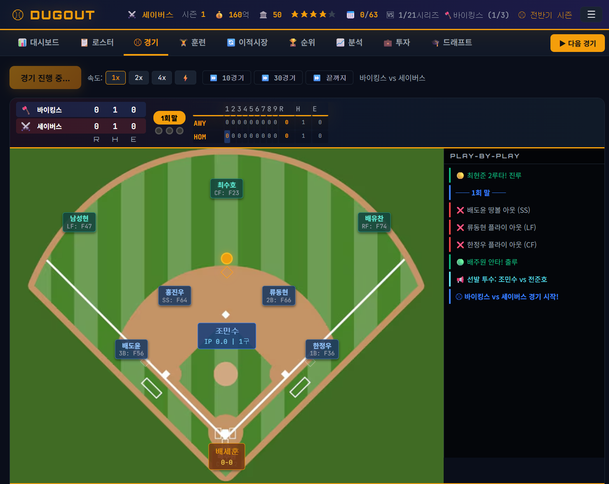
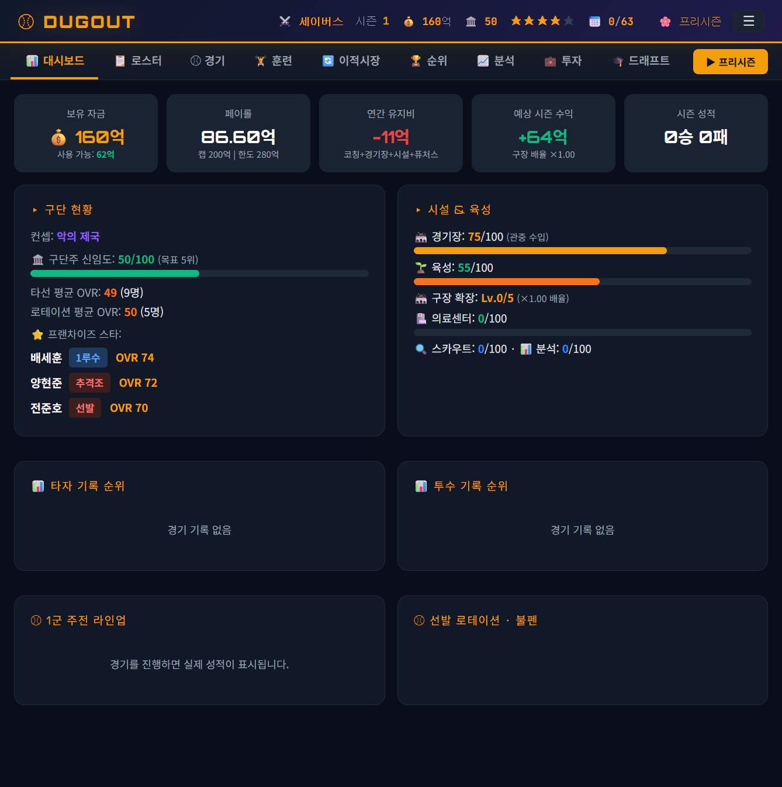
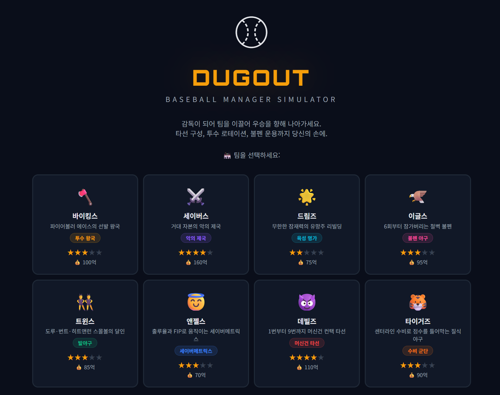
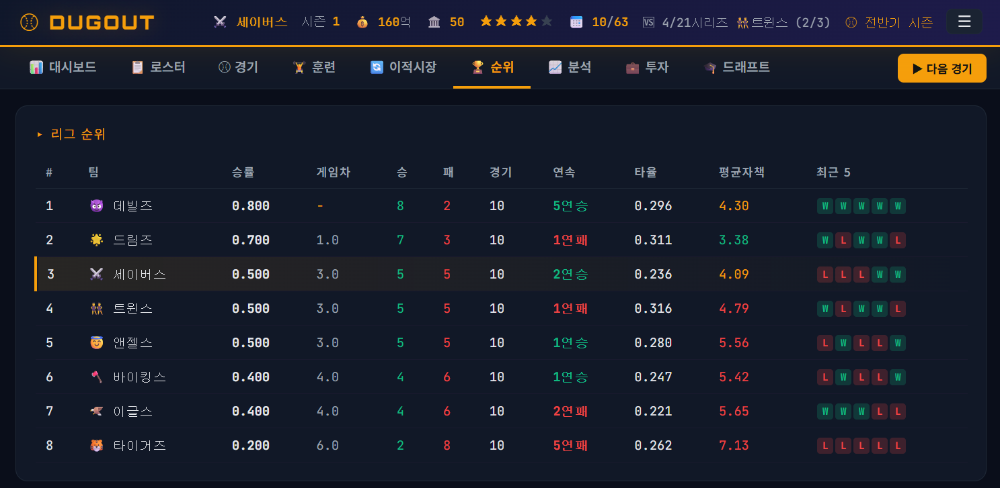
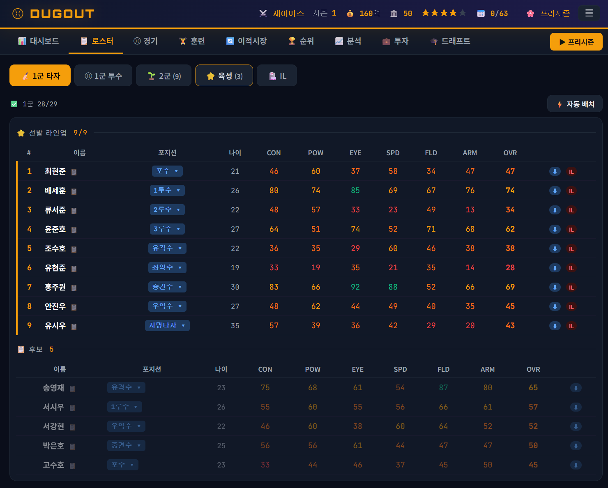
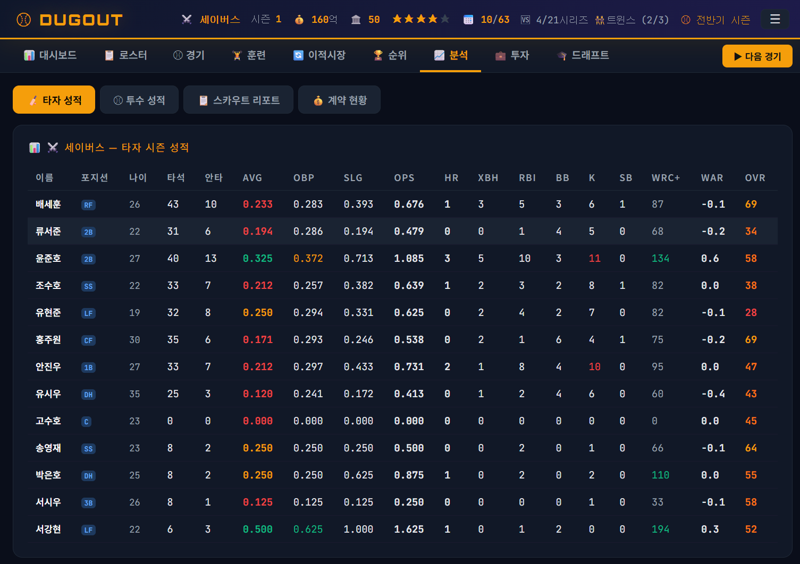
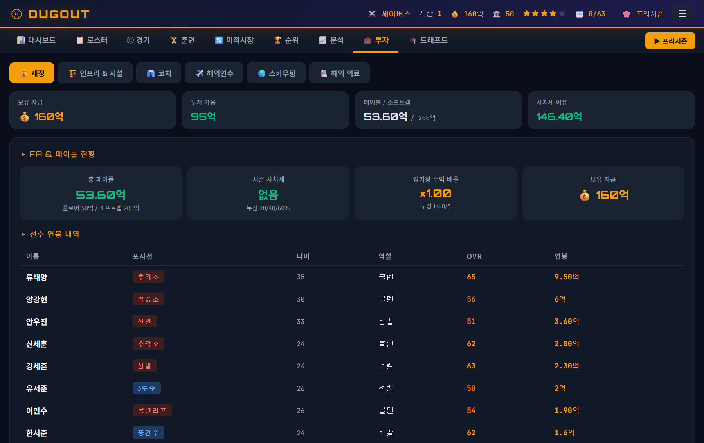

# ⚾ DUGOUT - 야구 구단 경영 시뮬레이터

_감독이 되어 타선·로테이션·불펜부터 드래프트·트레이드·FA·시설 투자·선수 육성까지, 63경기 시즌을 반복 경영하며 우승을 노리는 브라우저 야구 경영 게임_


🌐 **라이브 데모** : https://chyoung001.github.io/Baseball_manager/

8개 구단이 63경기 정규시즌을 치르고, 감독은 선수단을 평가해 라인업·로테이션·불펜을 짠다. 시즌이 끝나면 포스트시즌 → 시상식 → GM 회의(룰 투표) → 스토브리그로 이어지며, **구단주 신임도**가 0이 되면 경질(게임오버)이다. 프레임워크·빌드 도구 없이 순수 Vanilla JS로 브라우저에서 바로 실행된다.

> 실시간 경기 중계
<div align='center'>
  
</div>

## 목차

- [프로젝트 개요](#-프로젝트-개요)
- [8개 팀 아키타입](#-8개-팀-아키타입)
- [시즌 흐름](#-시즌-흐름)
- [선수 데이터 모델](#-선수-데이터-모델)
- [경기 시뮬레이션 엔진](#-경기-시뮬레이션-엔진)
- [재정과 투자](#-재정과-투자)
- [실행과 테스트](#-실행과-테스트)
- [아키텍처](#-아키텍처)
- [프로젝트 구조](#-프로젝트-구조)

---

## 📋 프로젝트 개요

| 항목 | 내용 |
|------|------|
| **장르** | 웹 기반 8팀 야구 구단 경영 시뮬레이션 |
| **규모** | ~9,500줄 · **JS 58개 모듈** + `index.html` + `style.css` |
| **기술 스택** | Vanilla JavaScript (ES6+), HTML5, CSS3 |
| **빌드 도구** | **없음** — `<script>` 로딩 순서로 의존성 관리, 브라우저 직접 실행 |
| **외부 의존성** | 없음 (Google Fonts CDN만 사용) |
| **데이터 저장** | `localStorage` (버전 태그 `_v` + 순차 마이그레이션, 현재 `_v:5`) |
| **테스트** | 헤드리스 스모크 하네스 (`tools/smoke-test.js`, Node `vm`, **181개 어서션**) |
| **UI 언어** | 한국어 |

> 대시보드
<div align='center'>
  
</div>

---

## 🧢 8개 팀 아키타입

각 구단은 고유 컨셉(플레이 스타일)과 예산·인기·시설·육성 기반값을 가진다.

| 팀 | 컨셉 | 정체성 | 예산 |
|---|---|---|:---:|
| 🪓 바이킹스 | `power_hit` | 파이어볼러 선발 왕국 | 100 |
| ⚔️ 세이버스 | `pitching` | 거대 자본의 악의 제국 | 160 |
| 🌟 드림즈 | `prospect` | 무한한 잠재력의 유망주 리빌딩 (육성 90) | 75 |
| 🦅 이글스 | `bullpen` | 6회부터 잠가버리는 철벽 불펜 | 95 |
| 👯 트윈스 | `speed` | 도루·번트·히트앤런 스몰볼 | 85 |
| 😇 앤젤스 | `sabermetrics` | 출루율과 FIP의 세이버메트릭스 | 70 |
| 😈 데빌즈 | `contact_hit` | 컨택 중심 | 110 |
| 🐯 타이거즈 | `defense` | 수비 중심 | 90 |

> 팀 컨셉은 훈련 배율·경기 엔진 보정(예: `power_hit` 투수 +5, `defense` 수비 +4)에 반영된다.

> 팀 선택 (8개 구단)
<div align='center'>
  
</div>

---

## ⚾ 시즌 흐름

정규시즌은 **63경기 = 21시리즈 × 3연전 고정**, 8개 페이즈가 한 시즌을 이룬다.

```
🌸 프리시즌 ─▶ ⚾ 전반기(G1~30) ─▶ ⭐ 올스타 & 드래프트 ─▶ ⚾ 후반기(G31~63, G43~ 확대 엔트리)
   ─▶ 🏆 포스트시즌(4팀 토너먼트) ─▶ 🏅 시상식 & 은퇴 ─▶ 🗳️ GM 회의(룰 투표) ─▶ 🔥 스토브리그(FA)
```

- **포스트시즌**: 상위 4팀 균형 토너먼트 — 1v4·2v3 준PO(5전 3선승) → 챔피언십(7전 4선승).
- **GM 회의**: 시즌 말 8개 구단 룰 투표(과반 가결) → `SeasonModifiers`(사치세 라인·확대 엔트리·드래프트 풍년 등)를 다음 시즌에 적용.
- **구단주 신임도**: 프리시즌에 목표 순위를 자동 제시하고, 시상식에서 성적·우승·재정으로 신임도를 증감한다. **신임도 0 = 경질(게임오버)**.

> 리그 순위
<div align='center'>
  
</div>

---

## 👤 선수 데이터 모델

**공개 능력치 (1~100, 50=평균 · 70+=엘리트)**

| 구분 | 항목 |
|------|------|
| 타자 | `contact` `power` `eye` `speed` `fielding` `arm` |
| 투수 | `stuff` `control` `velocity` `movement` `stamina` `clutch` |
| 히든 (10종) | `_potential` `_durability` `_consistency` `_clutchHidden` `_workEthic` `_versatility` `_ambition` `_loyalty` `_temperament` + 역할별 1종 |

- **OVR — Z-score 상대평가**: 고정 공식이 아니라 **포지션 그룹별 리그 평균 대비** `50 + (raw−mean)/std × 15`. `ovrRaw`(절대·성장/노화용)와 `ovr`(상대·가치/연봉용)를 분리하고, 다재다능(서브포지션) 세금을 차감한다.
- **3-Tier 스탯**: `statRaw`(Tier1) → `statRoster`(Tier2, 현재 pass-through) → `statEff`(Tier3, 소프트캡 125 로그 압축 + 특성 반영). **특성은 Tier3 전용**이며 OVR·연봉엔 반영하지 않는다.
- **특성 엔진**: 자연 특성(생성 15%) 슬롯 1 + 인공 특성 슬롯 2~3, S/A/B/C 랭크. 스택 상한(인공 동일 스탯 +10, 총합 +12).

**표시 스케일 (프론트오피스 레벨별 포그오브워)** — 타 구단·FA 선수는 분석팀 레벨에 따라 능력치 정밀도가 차등된다 (본인 팀은 항상 정확).

| 레벨 | 분석팀 Lv | 표시 |
|:---:|:---:|---|
| **L0** | <20 | 등급 문자 (S/A/B/C/D) |
| **L1** | 20~39 | 5단위 버킷 (예: 80~84) |
| **L2** | 40~59 | ±추정 (예: 81~87) |
| **L3** | ≥60 | 정확값 |

> 1군 로스터와 능력치
<div align='center'>
  
</div>

---

## 🎲 경기 시뮬레이션 엔진

매 타석은 **TTO(Three True Outcomes) → 인플레이** 2단계 확률 모델이다. 관전·AI·자동 시뮬 3경로가 단일 엔진 `resolvePA`를 공유해 통계 분포가 일치한다.

```
타자/투수 스탯(Tier3 statEff)
   │  ├─ 팀 컨셉 보너스 · 피로(투구수) · 컨디션 · consistency 스윙 · RISP 클러치
   ▼
resolvePA ──▶ ① TTO 확률   pHR / pK / pBB   (파크팩터 park.hr 곱셈)
          └─▶ ② 인플레이   BABIP·에러·GB/FB·xbh·3루타  (park.hit 곱셈)
   │
   ▼
각 경로가 확률로 롤 → 주루·득점·개인 스탯(ss/today) 누적
```

| 요소 | 내용 |
|---|---|
| 앵커 상수 | HR 2.5% / K 18% / BB 9% / BABIP 0.315 (MLB 근사) |
| 파크팩터 | 8구장 차등 `{hr, hit}` — 확률 변환 후 곱셈 (HR·BABIP에 적용) |
| 상황 보정 | 피로(50구~ 선형 감산) · 컨디션 · consistency · RISP 클러치 · 동적 회귀(비현실 성적 억제) |
| 투수 운용 | 스태미나 기반 투구수 한계, 보직 우선순위(CP/SU/MR/LR) 자동 교체 |
| 세이버 지표 | AVG/OBP/SLG/OPS/wOBA/FIP/wRC+/WAR — 시상(MVP·사이영·신인왕) 산정 기반 |
| 성장(XP) | 경기당 XP → OVR 밴드별 요구치 · 프로의식·야망 시너지 성장 배율 · 잠재력 천장 |

> 확률 모델은 현재 TTO 선형 근사이며, 설계의 **Logit/Softmax 2-stage + MLB 앵커 재타겟**은 아직 구현 전이다. 리그 총합 K%/BB%/BABIP/OPS/ERA 앵커 정합 하니스로 상시 검증한다.

> 타자 시즌 성적 (세이버 지표)
<div align='center'>
  
</div>

---

## 💰 재정과 투자

| 항목 | 현행 |
|---|---|
| 사치세 | 소프트캡 **200억**, 3단계 누진(200~220 20% / 220~250 40% / 250+ 60%) + 연속 초과 체증 |
| 샐러리 플로어 | 50억 (탱킹 방지 벌과금) |
| 급여 | 스토브리그 정산에서 **실차감** (`예산 = 수익 − 유지비 − 급여 − 준비금 감가`) |
| 준비금 감가 | 300억 초과분 연 30% 소각(구단주 배당) — 무한 흑자 방지 |
| 계약 단계 | 신인 슬롯(3년) → Arb(서비스 3~5, 슈퍼2) → FA(서비스 6+) |

**투자**: 구장 업그레이드 · 코칭 스태프(전문 코치) · 해외 스카우트 캠프 · 선수 개발 시설 · 해외 전지훈련 · 해외 의료.

> 투자 · 재정
<div align='center'>
  
</div>

---

## 🚀 실행과 테스트

### 실행

빌드가 없으므로 **정적 웹 서버**로 루트를 서빙하면 된다 (파일 프로토콜은 일부 브라우저에서 제약).

```bash
# 예: Python 내장 서버
python -m http.server 8000
# → http://localhost:8000/index.html 접속 → 팀 선택 → 게임 시작
```

- 저장: 게임 메뉴 `☰` → 💾 게임 저장 (localStorage)
- 백업: JSON 파일로 내보내기 / 가져오기 (`exportGame` / `importGame`)

### 테스트 (헤드리스 스모크)

브라우저 없이 Node `vm` + DOM/localStorage 스텁으로 전 모듈을 로드해 회귀를 검증한다.

```bash
node tools/smoke-test.js
```

> 커버리지 (T1~T26, **181 어서션**): 모듈 로드 · 63경기 풀시즌 시뮬 · 시리즈 구조 · 4팀 포스트시즌 · 8페이즈 · 스토브리그 멱등성 · 세이브 라운드트립 · 스케일 마이그레이션 · 밸런스 가드 · Z-score OVR · 히든 10종 · 서브포지션 · 3단계 사치세 · 서비스타임 · 3-Tier 스탯 · 특성 엔진 · 로스터 자동 배치 · 8구장 파크팩터 · 세이버 시상 · 경제 유계화 · 구단주 신임도 · `resolvePA` 3경로 공정성.

---

## 🧱 아키텍처

빌드 툴이 없으므로 **모든 함수·상수·상태가 전역 스코프에 공유**되고, 모듈 의존성은 오직 `index.html`의 `<script>` **선언 순서**로 보장된다. 프레임워크·번들러·가상 DOM 없이, 전역 상태 하나를 여러 렌더 함수가 읽어 화면을 다시 그리는 단순한 구조다.

### 데이터 흐름 — 단일 상태 `G`

모든 게임 상태는 전역 객체 `G` 하나에 모인다(`state-core.js`). 시즌·경기 수·페이즈·8개 팀 배열·내 팀·시장·드래프트 풀·이번 시즌 룰(`seasonModifiers`)이 여기 담기고, 화면은 언제나 `G`를 읽어 그린다.

```
사용자 액션 (onclick)
   │
   ▼
G 변경  ──▶  render*()  ──▶  $('...').innerHTML = `...`  ──▶  DOM
                  │              └ 헬퍼 $(id) = document.getElementById
                  ▼
           updateHeader()  ──▶  saveGame()   → localStorage
```

상태를 바꾼 뒤에는 관용적으로 **`render*() → updateHeader() → saveGame()`** 순서로 마무리한다. 이 세 단계가 화면 갱신·헤더 동기화·자동 저장을 한 번에 처리하는 사실상의 커밋 지점이다.

### 렌더링 모델

각 화면과 탭은 **템플릿 리터럴로 HTML 문자열을 만들어 `innerHTML`에 통째로 주입**하는 렌더 함수 하나로 그려진다(`renderDashboard`, `renderInvest` …). 이벤트는 대부분 전역 함수를 가리키는 인라인 `onclick`으로 연결한다. 가상 DOM·차분 갱신이 없으므로 상태가 바뀌면 해당 패널을 통째로 다시 그리고, 매 타석이 빠르게 바뀌는 경기 화면만 예외적으로 정적 뼈대에 `textContent`만 갈아 끼운다(`match-ui.js`).

### 상태 모델 — 파생 게터

팀 로스터는 별도 리스트를 두지 않고 **`team.roster` 단일 배열**로 관리하며, 구역은 `isPitcher`·`role`·`status` 필터로 파생한다.

| 게터 | 파생 조건 |
|---|---|
| `getBatters` / `getPitchers` | `isPitcher` 여부 |
| `getStartingBatters` / `getRotation` / `getBullpen` | `role` + `status==='active'` |
| `getFuturesPlayers` / `getDevPlayers` / `getILPlayers` | `status` (2군 / 육성 / IL) |
| `canCallUp` / `canPlayerDebut` / `canAddForeign` | 확대 엔트리 · 신인 데뷔 연도 · 외국인 한도 |

`status`가 없으면 `active`로 간주하는 `(p.status||'active')` 방어 표기를 곳곳에서 쓴다.

### 화면·탭 전환

라우터가 없다. 화면은 `.screen.active` CSS 클래스 토글로 바꾸고, 상단 탭은 `data-tab` 속성으로 대상 화면을 지정한다.

### 도메인 모듈 구조

기능 도메인이 커지면 `js/{도메인}/{도메인}-{역할}.js`로 나누고, 조립·진입 파일은 `{도메인}/{도메인}.js`로 둔다(예: `match/match-engine.js` ↔ `match/match.js`). 신규 모듈은 반드시 `index.html`의 `<script>` 목록에 의존성 순서대로 추가한다.

**스크립트 로딩 순서** (= 의존성 순서)

```
constants → utils/* → contracts/* → players/* → state/* → ui · dashboard
→ roster/* → match/* → training · market → trade/* → standings → analysis/*
→ season/* → invest/* → draft/* → title
```

### 저장 — 압축 스냅샷 + 순차 마이그레이션

세이브는 `localStorage['dugout_save']`에 버전 태그 `_v`(현재 **5**)를 붙여 담는다. 스냅샷은 `_buildSnapshot` 한 곳에서만 만들어 저장·내보내기 필드가 어긋나지 않고, `_compressPlayer`/`_compressTeam`가 기본값·팀 정적 데이터를 생략하는 델타 압축으로 용량을 줄인다. 로드 시 `_restoreFromData`가 옛 세이브를 현재 스키마로 **순차 마이그레이션**한다(예: `_v:4` 능력치 20-80→1~100, `_v:5` 히든 스탯 재스케일).

### 계층형 스탯 & 순수 매치 엔진

능력치 접근은 **3-Tier**(`statRaw → statRoster → statEff`)로 계층화되어, 시스템마다 다른 티어를 읽는다(OVR·트레이드가는 Tier1, 매치 엔진은 특성·소프트캡이 반영된 Tier3). 매치 엔진(`match-engine.js`)은 **DOM 접근이 없는 순수 수학 모듈**이라 헤드리스로 검증할 수 있고, 확률 계산은 단일 함수 `resolvePA`가 관전·AI·자동 3경로에 공유된다.

### 네임스페이스 규약

내부·사설 식별자는 언더스코어(`_potential`, `_compressPlayer`)로 공개 API와 구분하고, CSS는 도메인 접두사(`bc-`, `dd-`, `lu-` 등)로 분리해 충돌을 막는다.

---

## 📁 프로젝트 구조

```
Baseball_Manager/
├── index.html              # 단일 진입점 — <script> 로드 순서 = 의존성 순서
├── style.css               # 전역 스타일시트
├── image/                  # 이미지 에셋 (경기장 배경, 팀 로고)
├── tools/
│   └── smoke-test.js       # 헤드리스 회귀 테스트 하네스 (181 어서션)
└── js/                     # 게임 로직 (58개 모듈)
    ├── constants.js        # 게임 상수 · 팀 데이터(TEAMS_DATA) · 밸런스 값
    ├── ui.js · dashboard.js · standings.js · training.js · market.js · title.js
    ├── utils/              # utils-core / -stats / -scout / -economy
    ├── contracts/          # contracts-fa / -salary / -negotiation
    ├── players/            # player-core / -stats / -factory / -pools / -traits
    ├── state/              # state-core / -save / -init / -validation
    ├── roster/             # roster-logic / -field / -active / -reserve
    ├── match/              # match-state / -engine / -flow / -sim / -postgame / -ui / match
    ├── trade/              # trade-logic / -ui / trade
    ├── analysis/           # analysis-batters / -pitchers / -scout / -contracts / analysis
    ├── season/             # season-core / -finance / -postseason / -awards / -gm / -flow
    ├── invest/             # invest-finance / -infra / -scout / -players / invest
    └── draft/              # draft-logic / -preview / -live / -result / draft
```

> **모듈 배치 규칙**: 도메인이 커지면 `js/{도메인}/{도메인}-{역할}.js`로 분리하고, 조립/진입 파일은 `{도메인}/{도메인}.js`로 둔다. 신규 모듈은 `index.html`의 `<script>` 목록에 의존성 순서대로 추가한다.

